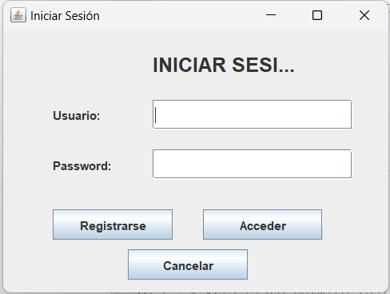

# **Proyecto-Calculadora**

## Descripción

Esta es una aplicación de calculadora desarrollada en Java que incluye un sistema de login para acceder a sus funcionalidades.
La calculadora permite realizar operaciones aritméticas básicas (suma, resta, multiplicación, división y porcentaje)
y guarda un registro de las operaciones realizadas, vinculándolas con el usuario que las realizó.

## Características

- Interfaz gráfica amigable (GUI) desarrollada con Swing.
- Sistema de inicio de sesión para diferentes usuarios.
- Registro de nuevo usuario.
- Calculadora con soporte para operaciones básicas: suma, resta, multiplicación, división y porcentaje.
- Historial de operaciones realizadas, incluyendo el nombre de usuario que las realizó, guardado en un archivo txt.
- Boton de Resultados que muestra las operaciones realizadas.
- Botón de calculadora circular personalizado.
- Validación de credenciales de usuario.

## Capturas de pantalla

Esta es la pantalla de Login de la aplicación:

Esta es la pantalla de Registro de la aplicación:

Esta es la pantalla de Calculadora de la aplicación:


## Instalación

Sigue los pasos a continuación para instalar y ejecutar el proyecto en tu entorno local:

### Requisitos previos

- **Java 8+**: Asegúrate de tener Java Development Kit (JDK) instalado en tu máquina. Puedes descargarlo [aquí](https://www.oracle.com/java/technologies/javase-downloads.html).
- **IDE recomendado**: NetBeans o IntelliJ IDEA, pero puedes usar cualquier editor que soporte proyectos en Java.

### Instrucciones de instalación

1. Clona este repositorio en tu máquina local:

   ```bash
   
   git clone https://github.com/usuario/Proyecto-Calculadora.git
   
2. Navega a la carpeta del proyecto:
   
   cd Proyecto-Calculadora
   
3. Abre el proyecto:
4. Compila y ejecuta el proyecto. Si estás usando un IDE como NetBeans, simplemente selecciona "Ejecutar" en el menú.
   
## Uso

Al ejecutar la aplicación, se mostrará una pantalla de inicio de sesión.
Primero registrate, ya que eres usuario nuevo.
Ingresa tus credenciales guardados para acceder a la calculadora.
Una vez dentro, puedes realizar operaciones aritméticas básicas.
El historial de operaciones realizas puedes ver presionando en boton "Resultados".
Cierra la aplicación cuando termine.

## Contribuciones

Las contribuciones son bienvenidas 

## Autores 

**Autores**: Proyecto desarrollado por el equipo **TechGO**

## Créditos 
- **Exp4j**: Se utilizo la biblioteca [Exp4j](https://www.objecthunter.net/exp4j/) para realizar la evaluación de expresiones matemáticas
- **JDK 22**: El proyecto fue desarrollado utilizando [Java Development Kit (JDK) 22](https://jdk.java.net/22/), que nos proporcionó las herramientas necesarias para compilar y ejecutar la aplicación.
- **Biblioteca Swing** - Para la creación de la interfaz gráfica (GUI)
- Inspirado en el diseño de calculadoras clásicas.
